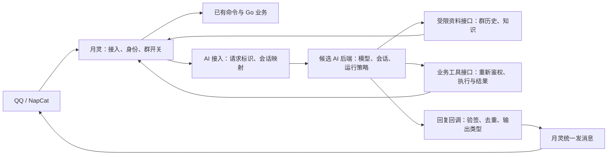

# 月灵 AI：同类产品调研与架构选型

日期：2026-09-22。本文保留实施前的调研依据。后续已完成固定版本的候选组件对照，并据此改造月灵运行链路；当前选择、证据和剩余范围见 [对照结果与本次实现](ai-evaluation.md)。尚未部署。

调研阶段先核对同类产品再决定实现，此前修复保留在工作区。本文区分官方文档事实、源码观察和针对月灵的建议；不以功能数量或项目热度代替可靠性证据。

## 调研时的候选选择

**先验证接入现成 AI 后端，再决定自研范围。LangBot 与 AstrBot 并列进入外接后端对照；ChatLuna/Koishi 用来检验会话与扩展边界。** 这是基于接口与迁移范围选择的验证对象，不是稳定性排名。

LangBot 官方提供签名 HTTP 入站、异步回复回调和同步调用。由此推断，月灵有机会保留 QQ 接入、已有命令和权限，把 AI 请求交给独立后端，而不必先把全仓库改写成 Python。需要另行解决群历史资料、业务工具、会话作用域和回复去重；HTTP 接入本身不会完成这些迁移。[官方 HTTP Bot 文档](https://langbot.app/docs/zh/usage/platforms/http-bot/)

AstrBot 同样提供基于 API Key 的对话 HTTP API，可通过 SSE 返回结果，文档注明该 API 自 v4.18.0 引入。因此不能把 AstrBot 限定为整套替换机器人；它也有独立后端接入路径。其外部用户名是调用方声明的身份，仍需月灵映射实际群成员与权限。[官方 HTTP API 文档](https://docs.astrbot.app/dev/openapi.html)

## 比较对象及适用边界

| 对象 | 本次关注的具体机制 | 对月灵的意义 | 尚不能推出的结论 |
| --- | --- | --- | --- |
| LangBot | HTTP Bot 接入；模型/流水线/插件边界；模型回退与工具循环 | 适合作为保留现有 Go 业务的 AI 后端候选 | 有重试或幂等键，不等于提醒等业务动作恰好执行一次 |
| AstrBot | OpenAPI 外接；平台适配、Agent 运行器、模型提供商、工具执行与消息事件 | 既可作为独立 AI 后端，也可比较完整机器人迁移 | 原生支持 QQ，不等于自动继承月灵的历史库和群权限 |
| ChatLuna + Koishi | 会话服务与运行时分离；上下文注入；工具筛选；独立消息渲染 | 可对照会话管理和扩展接口，也可评估整体迁移 | 文档有接口，不等于已在月灵模型和 NapCat 版本上实测 |
| Dify | 显式失败分支、节点运行记录、可视化流程 | 作为流程与诊断能力参考；需要运营编排时再评估接入 | 工作流平台不能直接代替 QQ 群聊机器人所有职责 |

AstrBot、LangBot 的固定源码版本、官方资料与逐项结论见[来源附录](ai-products-source-research.md)。以下补充 ChatLuna/Koishi、Dify 及月灵对照。

### ChatLuna / Koishi：会话是独立能力

- **文档事实：** `ConversationService` 负责会话、绑定、访问控制、归档；`ConversationRuntime` 负责锁、活跃请求、停止请求、缓存和压缩。清空/同步操作可先停止活跃请求。[会话服务](https://chatluna.chat/development/api-reference/conversation-service.html)、[会话运行时](https://chatluna.chat/development/api-reference/conversation-runtime.html)
- **文档事实：** Agent API 接受历史、取消信号、请求标识和步骤回调；工具选择接口同时接收会话历史与工具可用范围。事件区分工具调用、工具结果和结束。[Agent API](https://chatluna.chat/development/api-reference/llm-core/agent.html)
- **文档事实：** 上下文有单独的注入管线；消息渲染也通过独立服务实现，支持文本、图片、语音等输出。[上下文管理](https://chatluna.chat/development/api-reference/llm-core/context-manager.html)、[消息渲染](https://chatluna.chat/development/api-reference/middleware/message-renderer.html)
- **文档事实：** Koishi 通过服务依赖管理插件加载/回滚，并在插件卸载时回收相关副作用。[服务依赖](https://koishi.chat/zh-CN/guide/plugin/service)、[生命周期](https://koishi.chat/en-US/guide/plugin/lifecycle)
- **建议：** 借鉴这些职责划分，使“清除对话”“停止生成”“禁用功能”都有明确运行时行为。对于 Go 内核，不必照搬 JavaScript 热重载系统。
- **局限：** 本次未运行 ChatLuna。其[旧配置页](https://chatluna.chat/guide/useful-configurations.html)使用 `plugin` 模式名，而[聊天模式页](https://chatluna.chat/guide/chat-chain/chat-mode.html)使用 `agent`；采用时需锁定发布版本并核对配置。GitHub API 本次访问遇到限流，未完成当前源码版本固定，以上只标为文档事实。

### Dify：失败和排查也是产品功能

- **文档事实：** LLM、HTTP、代码和工具节点可选择停止、默认值或失败分支，并提供错误类型变量。[错误处理](https://docs.dify.ai/en/cloud/use-dify/build/predefined-error-handling-logic)
- **文档事实：** 运行日志可查看节点轨迹、状态、耗时和 token，并以原输入再次测试。[运行日志](https://docs.dify.ai/en/cloud/use-dify/monitor/logs)
- **文档事实：** 官方自托管方案包含多个应用服务和数据库、缓存、沙箱等依赖。[部署文档](https://docs.dify.ai/en/self-host/deploy/quick-start/docker-compose)
- **建议：** 月灵至少应能定位“取群记录失败、模型失败、工具失败、QQ 发出失败”中的哪一步。暂不为了这一点直接增加整套 Dify 部署；若确有可视化编排需求，再将它作为运行后端比较。

## 调研阶段发现的月灵缺口

以下是实施前工作区的观察，包含更早的未提交修复；不是对线上版本状态的断言。生命周期、总结任务和结果状态等后续改动见 [本次实现](ai-evaluation.md)。

| 代码事实 | 对用户的影响或风险判断 | 架构上需要补足什么 |
| --- | --- | --- |
| `Dispatch` 组织预检、记忆提示、会话、工具选择、执行和自动记忆写入 | 增加能力容易牵动多个运行策略 | AI 请求边界、执行策略、上下文获取分开，依赖显式传入 |
| `Route` 只根据本句触发词/正则/关键词选最多 8 个工具 | “昨天呢”缺少任务词时，可能失去继续查询所需工具 | 把当前任务和会话历史纳入选择；明确请求参数不足时的行为 |
| `Session` 直接保存提供商 SDK 消息，5 分钟内存会话；删除仅移除映射 | 业务任务与模型协议耦合；清除会话不等于取消已运行请求 | 区分任务状态、模型往返记录和活跃请求；定义清除/停止/重启语义 |
| `ToolHandler` 返回字符串和 error；有些失败返回中文字符串、nil | 程序不能可靠区分成功、无结果、失败和执行状态不明；日志 `success=err==nil` 也可能误导 | 工具结果有明确状态和执行凭据；旧工具需逐项适配，不能靠匹配中文判断成功 |
| 相同工具参数目前只在本轮缓存；确认状态与会话在进程内 | 模型重试之外，跨请求或重启后的重复动作仍需单独处理 | 从消息到业务动作的幂等与结果核对；入站去重不替代业务幂等 |
| 总结资料按条数/字符数取样，日期读取前若干条 | 可能遗漏时间段后半部分，不能承诺“总结了全天” | 取样范围与来源可见；完整历史总结另设分页/分段聚合策略和预算 |
| 已有统一模型模块、超时、有限重试、协议验证、工具权限检查和回归测试 | 有可保留的基础，但不足以证明生产可靠性 | 用同一组测试比较自研与外接实现；保留必要防线，避免重复建设 |
| 所检查的 AI 调用链日志主要记录群/用户/步骤、工具名和错误 | 一条消息跨模型/工具/发送阶段的定位仍不完整 | 贯穿请求标识、分阶段结果和耗时，能用脱敏样例复现 |

对应代码：[调度与执行](../ai/dispatcher.go)、[路由](../ai/route.go)、[会话](../ai/session.go)、[工具接口](../ai/registry.go)、[总结资料](../ai/tools/analysis.go)、[模型模块](../services/llm/client.go)、[消息入口](../plugins/ai_dispatch/plugin.go)。

长期记忆还有独立的产品选择：目前个人记忆主要按用户保存，群规则按群保存。跨群共享哪些个人信息应明确设定，不能因换框架就默认改变作用域。[现有记忆代码](../ai/memory.go)

## 三条路线的取舍

| 路线 | 能复用什么 | 仍要承担什么 | 当前判断 |
| --- | --- | --- | --- |
| 月灵作为消息/业务入口，外接 LangBot 或 AstrBot AI 后端 | 现有 QQ 接入、Go 插件、权限及业务库；后端模型与运行能力 | 双方会话映射、群历史接口、工具桥接、回调或流事件处理、额外服务运维 | 优先做两候选的小范围对照；已有官方 HTTP 接口作为依据 |
| 整体迁移到 AstrBot、LangBot 或 ChatLuna/Koishi | 候选平台的接入、管理面板和扩展生态 | 迁移或桥接月灵专有命令、群开关、记忆；确保每条消息只有一个回复负责人 | 外接方式若无法满足需求，再比较全量迁移；不能按“安装完框架”估算完成 |
| 保留 Go，自建清晰的 AI 内核 | 已有业务集成与部署方式，避免跨服务适配 | 长期维护模型兼容、会话执行、工具协议、排查体验和扩展接口 | 只有对照结果证明外接成本不合适时，才作为最终选择 |

上表迁移成本是基于边界的工程判断，尚无实施工时或性能数据。不能因为当前是 Go 就排除成熟框架，也不能因为框架功能多就忽略迁移成本。

外接路线的建议边界如下，尚未实现：

候选后端不能自行假定群管理权限；最终执行仍由拥有真实身份与群开关的业务端决定。HTTP Bot 的入站去重不等于群消息投递或业务动作幂等。第一轮原型应只接普通对话与只读总结，验证后再接写操作。

## 用同一组场景选型，而不是凭感觉换架构

以下是调研阶段提出的对照场景。后续实际执行层级、替身范围和未覆盖项见 [总报告](ai-evaluation.md)，没有把计划中的场景全部标为通过。此前月灵自身的验证记录见 [ai-rebuild.md](ai-rebuild.md)。

比较时锁定候选版本，使用同一模型/参数、同一份虚构群聊、同一工具返回和故障脚本。分别记录正常路径与故障路径；配置差异保留在报告中。第一轮排除真实群发送和真实写操作。

| 场景 | 检查内容 |
| --- | --- |
| `@月灵 总结群聊` | 自动获取正确资料，结论有依据，不向用户展示内部协议 |
| `昨天呢`、`只列待办` | 延续任务并正确修改时间/输出类型，不误用上一份资料 |
| 空记录、历史接口断开 | 明确报告资料不可用或无内容，不编造聊天 |
| 超长一天聊天 | 报告覆盖范围；如采用分段总结，能覆盖后段关键事实 |
| 模型 429/503/超时/401 | 重试有界、错误可分类；鉴权错误不无限重试 |
| 畸形工具参数、截断输出、工具协议混入正文 | 不执行损坏请求，最终输出无协议泄漏 |
| 工具已完成但最终生成失败 | 保留可核对结果，不自动重复写操作 |
| 模型回退后继续工具循环 | 历史及工具结果保持兼容，不任意跨模型重放 |
| 禁用插件、无权限用户、另一群同名资料 | 工具执行时重新检查身份与范围，无越权取数或执行 |
| 同用户并发、不同用户并发 | 同会话状态一致，不串消息；不同会话互不串数据 |
| 生成中停止/清除对话 | 活跃请求、旧结果发送和新会话的关系符合约定 |
| 重复消息、重复/乱序回调 | 不重复答复；动作执行数量可核对 |
| 知识问答和记忆删除 | 回答能标出处；删除/修改后的作用域和生效行为正确 |

每个场景记录：是否通过、实际资料范围、模型调用次数、耗时、token、错误类别、回复次数、动作执行次数、实现适配所需改动。延迟与成功率只有实测后填写；小样本通过也不写成线上可用性保证。

## 新能力的优先次序

其中一些能力已经有入口；这里规划的是补齐体验和可靠性后再扩展，不把已有功能重新命名为新增功能。

1. **先把群聊助理做完整：** 日期/主题总结、决策/待办/未解决问题、引用出处、连续追问，明确历史覆盖范围。
2. **再补知识和记忆体验：** 带来源的群知识问答，可查看/修改/删除的个人与群记忆，明确跨群共享规则。
3. **再扩展输入与查询：** 图片、文件和带来源的联网检索；按实际模型能力开放。
4. **最后扩大执行能力：** 提醒、订阅与群管理等工具，先定义结果核对和防重复机制，再增加自主执行范围。

这是月灵的建议顺序，不是上述产品均已完成的功能承诺。候选对照已完成到组件与模拟接入层，后续实现采用理由及仍未交付的能力均记录在 [对照结果](ai-evaluation.md)。
