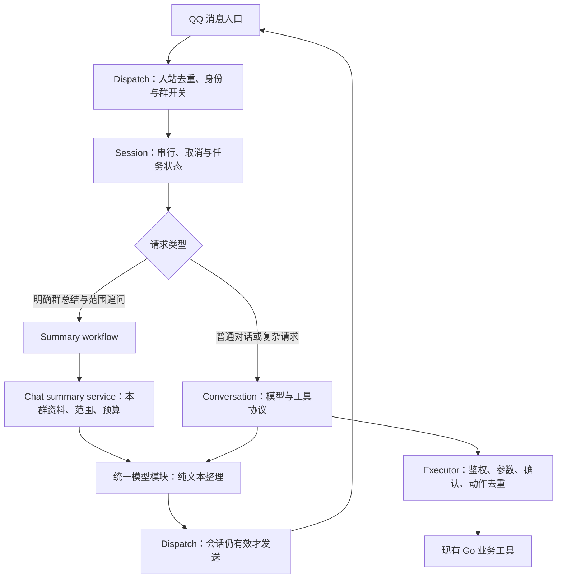

# AI 架构对照结果与本次实现

日期：2026-09-22。对应 v1.22.0 发布批次；生产群尚未验收。候选使用固定源码、虚构群聊与可控故障，未向候选发送真实群资料。以下是组件和接入行为的证据，不是产品整体稳定性排名。

后续用户报告“取数成功但生成不完整”的诊断及 v1.22.1 修复另见 [群总结输出额度诊断](ai-summary-output-limit.md)，不以本页早先测试代替补丁验证。

## 采用的路线

本次保留 Go 的消息入口、身份、权限、业务数据及执行职责，拆分 AI 运行链路；暂不把 AstrBot OpenAPI 或 LangBot HTTP Bot 直接接到生产群。两个候选都提供可用的模型/工具基础，但实测仍需月灵负责动作去重、取消、回复归属和输出过滤。简单替换接口不能消除用户报告的问题，还会增加跨服务状态协调。

这是针对当前接入范围的工程选择。没有测量完整迁移工时、长期故障率或吞吐量，不能据此断言自研长期成本更低。以后引入候选，应先完成本文列出的接入契约，再以相同故障脚本复测。

## 对照证据

| 项目 | 实际运行范围 | 有效机制 | 与月灵需求的差距 |
| --- | --- | --- | --- |
| AstrBot 4.28.1，`95e98b8` | 原始 ToolLoopAgentRunner、OpenAI 提供商、工具执行器；合成 HTTP 模型；上游运行器/会话/API 测试 86 项通过 | 推理、工具事件和最终回复分开；工具后模型 503 重试未重放已执行动作；运行器主动 stop 可取消请求 | 模型重复请求同一动作会执行两次；正文伪 `<tool_call>` 原样返回；提供商原始错误可能进入普通错误消息；HTTP 断连按其设计不会自动停止后台任务 |
| LangBot 4.10.11，`6b83089` | 原始 HTTP Bot 适配器、LocalAgentRunner、SessionManager；合成监听器/模型；上游组件测试 35 项通过 | HTTP 验签、显式幂等键、异步回调；首轮模型错误可回退；可通过复合会话 ID 隔离用户 | `/sync` 超时仍继续处理；同会话紧接着第二次 `/sync` 收到第一次的迟到答案；调用方取消不停止监听器；同参数动作可执行两次；隐藏结构化调用不拦截正文伪协议 |
| 月灵本次实现 | 真实 Go Dispatch、注册工具、WebSocket 入口，模拟 OneBot/模型；会话/工具/取数故障回归 | 明确总结直接取资料；任务状态独立于 SDK 历史；会话取消延伸到发送；入站消息与同回合工具去重 | 仍有旧工具字符串接口；消息去重仅限进程内；没有自动备用模型回退；日期总结仍取样；真实 QQ/NapCat 尚未验收 |

AstrBot 的“动作未重放”与“重复动作执行两次”属于不同场景：前者是模型 HTTP 重试，后者是模型主动再次生成相同业务调用。LangBot 的同步串答是本次固定版本和合成监听器下的可复现结果，不能扩展成所有模式都会串答。

详细版本、依赖、脚本、原始结果及替身边界分别在 [AstrBot 报告](ai-evaluation-astrbot.md)、[LangBot 报告](ai-evaluation-langbot.md)、[月灵覆盖矩阵](ai-evaluation-yueling.md)。最初的产品比较与官方来源保留在[调研报告](ai-architecture-research.md)。

## 已实施的职责划分

1. `services/llm` 负责提供商兼容、限时、有限重试、错误分类及异常响应校验，所有生产模型调用共用这一层。
2. `ai/session.go` 管理短期会话和生命周期。重置、过期替换、驱逐取消旧会话；普通回合、确认工具、自动记忆与发送继承取消。已经交给 QQ 的消息和已经发生的外部动作不能通过取消撤销。
3. `ai/summary_workflow.go` 识别明确的群聊整理请求，类型化保存范围、模式、主题和上次答复。`昨天呢`、`只列待办`重新读资料；明确的简短解释追问保留任务，新主题/引用/附件结束任务。未识别表达仍走通用模型路径，没有宣称覆盖所有自然语言。
4. `services/chatsummary` 统一取数、来源消息 ID、范围说明及实际 JSON 预算。无记录、读取失败和取消分别处理；截断后没有有效资料也不会调用模型。总结不在工具内部嵌套请求模型。
5. `ai/conversation.go` 只管理模型往返与工具调用协议。历史推理及工具配对保留在协议层，不直接作为 QQ 回复。
6. `ai/executor.go` 在执行前重新鉴权、检查群开关和参数。结果区分 `reported`、`rejected`、`failed`、`confirmation_required`，并记录是否可能发生副作用。旧 handler 返回字符串且没有 error，只能标记“已返回”，不能自动认定业务成功。
7. `ai/requests.go` 以机器人、群、用户、消息 ID 识别重复入站消息，完成后保留 5 分钟。失败也保留，避免丢失回复后重复执行。工具缓存覆盖同回合重复请求；一次性提醒创建另按内容及实际时刻归一化动作身份。重复提醒、update 和其他工具仍使用解析后的 JSON 身份，没有全面业务幂等。
8. 日志按消息标识关联接收、总结取数、模型、工具、发送，记录状态和耗时，不输出提示词、工具参数或提供商原始错误正文。

## 能力与限制

本次补齐群聊整理的连续请求：最近/今天/昨天/本周/近 7 天、话题/决策/待办/未解决问题、关注主题。近期总结读取 NapCat 历史；日期总结读取本群本地保存记录。默认条数来自配置，范围为 10—100 条；日期查询取前 N 条，不能代表完整一天。来源 ID 随资料传入并要求模型引用，但尚未实现逐条结论的自动证据校验。

本次没有引入数据库迁移、外部 AI 服务配置、持久动作账本、全量历史分页总结、文件解析或自动模型回退。已有天气、订阅、提醒、知识库等工具继续使用；没有把既有功能重复算作新增。旧业务工具需要逐项迁移到更明确的业务结果及持久幂等接口，这是剩余架构工作。

## 验证与发布边界

最终执行记录见[月灵验证报告](ai-evaluation-yueling.md)。所有候选实验只证明报告标明的组件范围；本次 Go 测试包含真实 WebSocket 处理器与模拟模型、OneBot，不是实际 QQ 投递。此前数据库测试记录单独保留在 [ai-rebuild.md](ai-rebuild.md)，不能当作本次最终代码已经带数据库复测的证据。

生产验收仍需真实 NapCat 历史权限、模型/网络、QQ 收发和原故障日志。发布时保留旧镜像及配置，在测试群核对：总结与日期追问、无资料、关闭插件、生成中重置、一次无副作用查询，以及一项可核对结果的提醒。确认无持续认证/协议错误后再扩大范围。若异常则回切旧镜像；本次没有数据结构迁移，回切不需要回滚业务表。

若将来接候选后端，至少先验证：请求 ID 与回复归属；超时/取消时服务端任务语义；群/用户会话映射；权限回传并在 Go 侧重验；类型化输出及正文过滤；动作身份、确认、结果核对；失败重启后的持久状态。通过这些实测后再考虑把运行职责交给外部服务。
